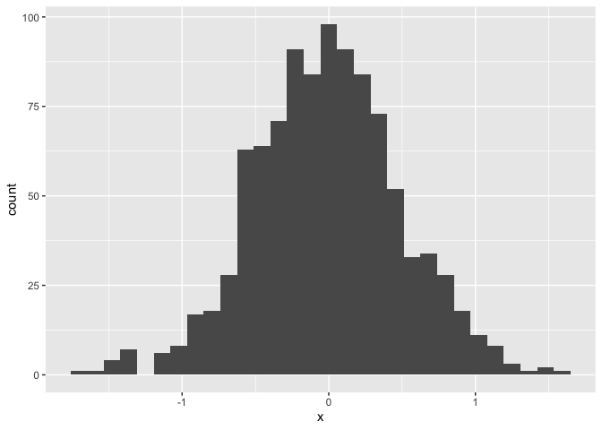

P8105 Homework 1 Submission
================
Rebecca Shyu
2019-09-12

[Homework Assignment Details](https://p8105.com/homework_1.html)

Problem 0.1:

- Create a public GitHub repo + local R Project (p8105_hw1_rs4338)
- Create a single .Rmd file named p8105_hw1_rs4338.rmd that renders to
  github_document
- Submit a link to your repo via Courseworks:
  (<https://github.com/rysgpd/p8105_hw1_rs4338>)

Problem 1:

- Load the Palmer Penguins dataset
- Describe the `penguins` dataset
  - Names/Variables:
    - Species (Adelie, Chinstrap, Gentoo)
    - Island (Biscoe, Dream, Torgersen)
    - Bill Length (in mm)
    - Bill Depth (in mm)
    - Flipper Length (in mm)
    - Body Mass (in g)
    - Sex (Female, Male)
    - Year (2007, 2008, 2009)
  - Size of the dataset: 344 rows, 8 columns/variables

``` r
data("penguins", package = "palmerpenguins")


# code to get all column names
columns_names = colnames(penguins)
# code to find the notable variables
species_types = unique(penguins$species)
island_types = unique(penguins$island)
sex_types = unique(penguins$sex)
years_included = unique(penguins$year)

ncol(penguins)
```

    ## [1] 8

``` r
plot_df = tibble(
  x = rnorm(1000, sd = .5),
  y = 1 + 2 * x + rnorm(1000)
)
```

First we show a histogram of the `x` variable.

``` r
ggplot(plot_df, aes(x = x)) + geom_histogram()
```

    ## `stat_bin()` using `bins = 30`. Pick better value with `binwidth`.

<!-- -->

Next we show a scatterplot of `y` vs `x`.

``` r
ggplot(plot_df, aes(x = x, y = y)) + geom_point()
```

<!-- -->
