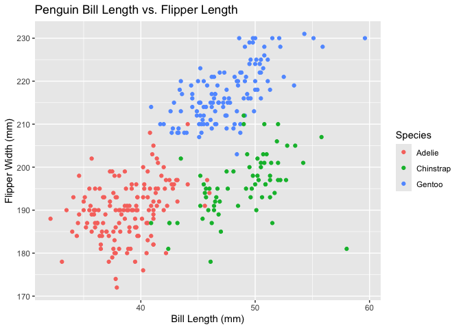

P8105 Homework 1 Submission
================
Rebecca Shyu
2019-09-12

[Homework Assignment Details](https://p8105.com/homework_1.html)

Problem 0.1:

- Create a public GitHub repo + local R Project (p8105_hw1_rs4338)
- Create a single .Rmd file named p8105_hw1_rs4338.rmd that renders to
  github_document
- Submit a link to your repo via Courseworks:
  (<https://github.com/rysgpd/p8105_hw1_rs4338>)

Problem 1:

- Load the Palmer Penguins dataset
- Describe the `penguins` dataset
  - Names/Variables:
    - Species (Adelie, Chinstrap, Gentoo)
    - Island (Biscoe, Dream, Torgersen)
    - Bill Length (in mm)
    - Bill Depth (in mm)
    - Flipper Length (in mm)
    - Body Mass (in g)
    - Sex (Female, Male)
    - Year (2007, 2008, 2009)
  - Size of the dataset: 344 rows, 8 columns/variables
  - Mean Flipper Length: 200.9152 mm

``` r
data("penguins", package = "palmerpenguins")

# code to get all column names
columns_names = colnames(penguins)

# code to find the notable values of categorial variables
species_types = unique(penguins$species)
island_types = unique(penguins$island)
sex_types = unique(penguins$sex)
years_included = unique(penguins$year)

# code to find the number of rows and columns
col_num = ncol(penguins)
row_num = nrow(penguins)

# code to find the mean flipper length
mean_flipper_length = mean(penguins$flipper_length_mm, na.rm = TRUE)
```

Then, we show a scatterplot of the `flipper_length_mm` (y) vs
`bill_length_mm` (x) variable.

``` r
ggplot(penguins, aes(x = bill_length_mm, y = flipper_length_mm)) + geom_point(aes(color = species), na.rm=TRUE) +
  ggtitle("Penguin Bill Length vs. Flipper Length") +
  xlab("Bill Length (mm)") +
  ylab("Flipper Width (mm)") +
  labs(col="Species")
```

<!-- -->

``` r
# export the scatterplot 
ggsave("penguins_scatterplot.png")
```

    ## Saving 7 x 5 in image
